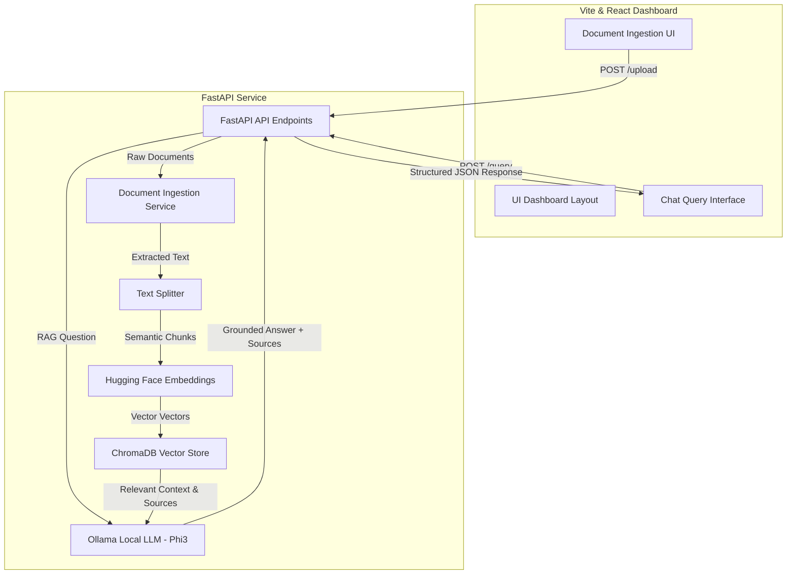

# 🧠 Secure Local RAG Platform

A high-performance local Retrieval-Augmented Generation (RAG) platform featuring a **FastAPI** backend, **ChromaDB** vector storage, local **Hugging Face** embeddings, **Ollama** model orchestration, and an interactive **React + Vite** dashboard. 

This project is designed using clean architecture patterns, service-oriented encapsulation, and full local execution, making it a secure and standalone document intelligence platform.

---

## 🏗️ System Architecture



---

## 🚀 Key Features & Engineering Highlights

### 1. Service-Oriented Modular Architecture
Designed with strict separation of concerns. Core operations—including LLM orchestration, embedding generation, vector database interactions, text splitting, and document parsing—are encapsulated in isolated services (`app/services/*`), promoting reusability and clean API interfaces.

### 2. Evidence-Based Answers (Source Attribution)
RAG platforms in production require verification. The query engine extracts unique source filenames from context metadata and maps them directly to the LLM response. The React UI renders these as visual evidence pills below the generated text, ensuring answers can be traced back to original docs.

### 3. Dynamic Real-Time Ingestion
Features a `POST /upload` endpoint. Users can upload new documents (`.pdf`, `.txt`, `.md`) from the frontend UI. The server saves, parses, splits, embeds, and indexes them into the active database in real-time, instantly making them searchable without requiring server restarts.

### 4. Fully Local & Secure Inference
Maintains absolute data privacy. Embedding generation uses Hugging Face's `all-MiniLM-L6-v2` locally on device, and LLM text generation is orchestrated locally using Ollama (`phi3`). No private document content is ever sent to third-party APIs.

### 5. Automated Data Purging & CLI Tools
Includes a robust ingestion CLI (`ingest.py`) with support for directory scanning and a `--reset` option to safely clear collections and purge sensitive documents completely from local vector databases.

---

## 🛠️ Tech Stack

| Layer | Technology |
| :--- | :--- |
| **Backend Framework** | FastAPI, Uvicorn, Pydantic |
| **RAG Orchestration** | LangChain, LangChain-Chroma, LangChain-Ollama |
| **Embeddings Model** | Hugging Face (`sentence-transformers/all-MiniLM-L6-v2`) |
| **Local LLM Model** | Ollama (`phi3` / `llama3` compatible) |
| **Vector Database** | ChromaDB (local file persistence) |
| **Frontend UI** | React 18, Vite, Axios, TailwindCSS |

---

## ⚙️ Quick Start

### Prerequisites
- Python 3.10+
- Node.js & npm
- [Ollama](https://ollama.com/) (installed and running locally)

### 1. Clone & Set Up Environment
```bash
git clone https://github.com/diwakeryadav/gen_ai_rag_assistant.git
cd gen_ai_rag_assistant
```

### 2. Configure Local LLM
Start Ollama and pull the lightweight `phi3` model:
```bash
ollama run phi3
```

### 3. Set Up & Run the Backend
From the repository root:

1. Create and activate a Python virtual environment:
   ```bash
   python -m venv .venv
   .\.venv\Scripts\activate   # On Windows
   source .venv/bin/activate  # On macOS/Linux
   ```
2. Install python dependencies:
   ```bash
   pip install -r requirements.txt
   ```
3. Run the database reset and bulk ingest script (Optional - populates sample safe documents):
   ```bash
   python ingest.py --reset
   ```
4. Start the FastAPI development server:
   ```bash
   python -m uvicorn app.main:app --reload
   ```
The backend API documentation is now live at [http://127.0.0.1:8000/docs](http://127.0.0.1:8000/docs).

### 4. Set Up & Run the Frontend UI
From a separate terminal window:

1. Navigate to the frontend directory:
   ```bash
   cd frontend
   ```
2. Install npm dependencies:
   ```bash
   npm install
   ```
3. Start the Vite development server:
   ```bash
   npm run dev
   ```
The web interface is now running at [http://localhost:5173](http://localhost:5173).

---

## 🧪 Testing the RAG Pipeline
To test individual services locally, standard utility scripts are available:
- **Test PDF Loader**: `python test_loader.py`
- **Test LLM Orchestration**: `python test_llm.py`
- **End-to-End Console RAG**: `python rag_pipeline.py`
