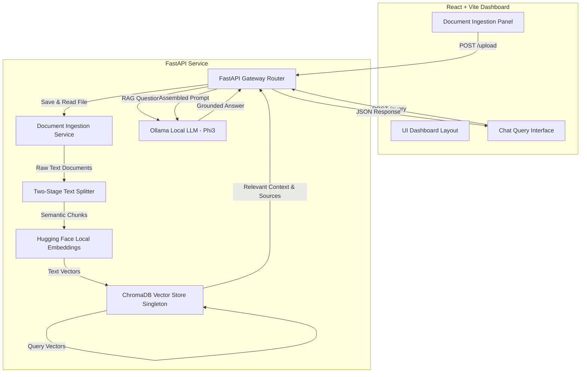
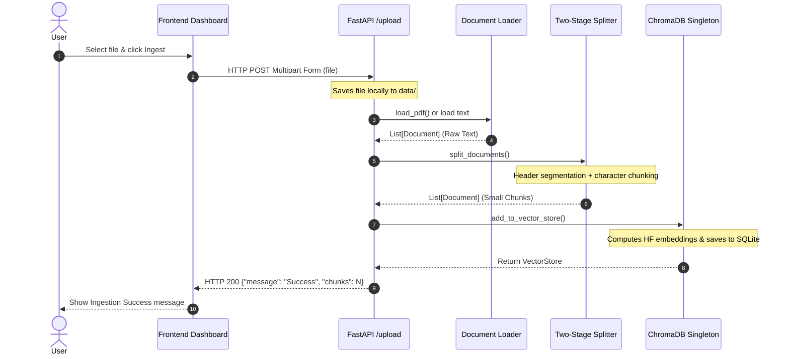
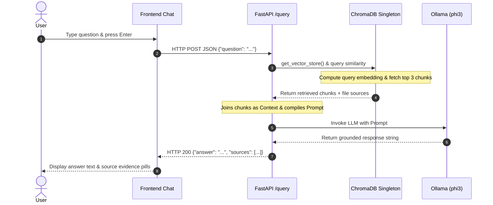
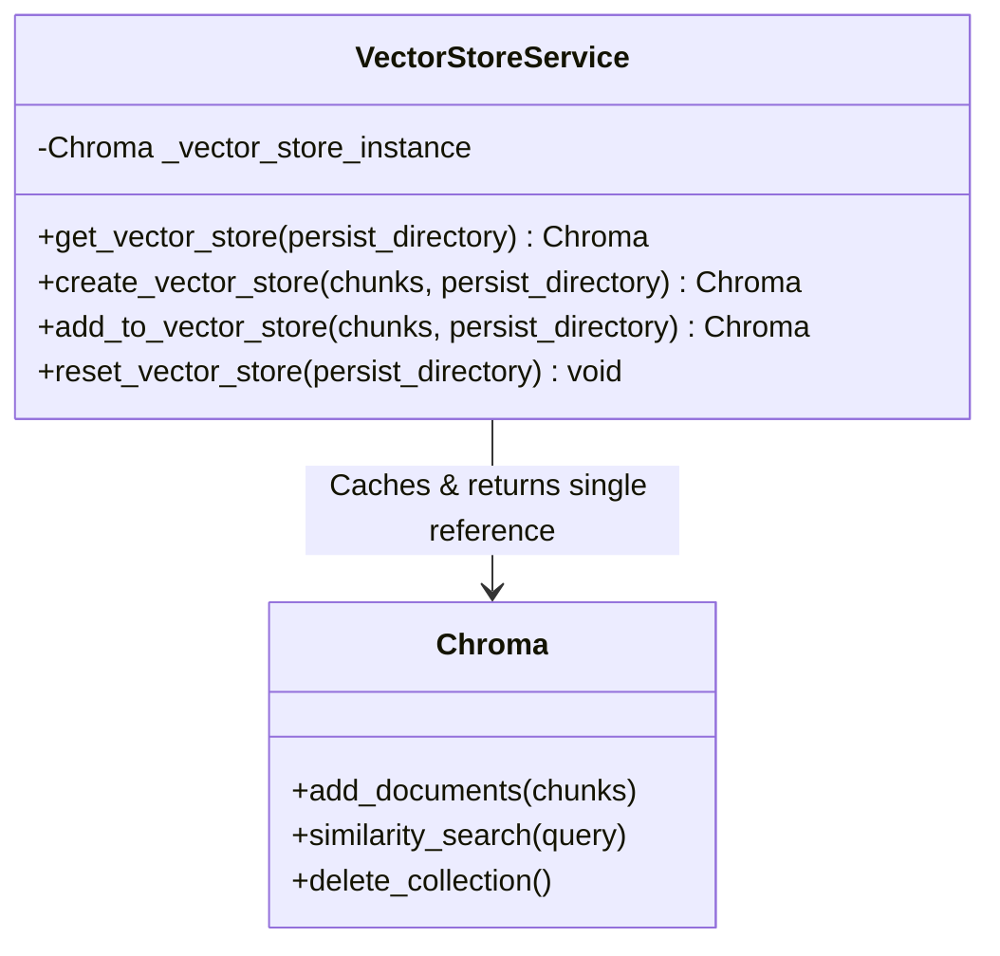
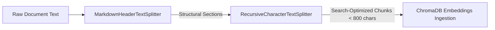

# Intelligence RAG Platform - Complete System Design & Codebase Guide

This document contains the complete system architecture, high-level and low-level design specifications, and file-by-file developer annotations for the Intelligence RAG Platform.

---

## 🏗️ High-Level System Design (HLD)

The system operates as a self-contained, fully offline Retrieval-Augmented Generation (RAG) assistant. All embedding generation, vector search operations, and LLM text inferences occur locally on the user's host machine to ensure absolute data privacy and security.

### 1. System Architecture
Below is the block architecture diagram representing the components of the platform:



### 2. Component Directory & Responsibilities
- **Frontend Dashboard (React 18 / Vite)**: Serves as the user interface, supplying input modules for document uploading and chat querying. Uses Axios to communicate with the backend.
- **FastAPI Web Server**: Serves as the system gateway/router. Receives REST requests, validates payloads via Pydantic schemas, handles files, coordinates background RAG workflows, and manages CORS security.
- **Ingestion Pipeline**: 
  - **Document Loader**: Extracts raw text representation from `.pdf`, `.txt`, and `.md` formats.
  - **Text Splitter**: Slices text into overlapping, search-optimized chunks.
  - **Embedding Generator**: Converts text chunks into 384-dimensional dense vectors using a local sentence transformer model.
  - **Vector DB Store**: Persists vectors and chunk text to SQLite-backed database files using a cached singleton connection.
- **RAG Execution Engine**: Retrieves context matching user prompts, compiles context-grounded prompt packages, and triggers local LLM generation.
- **Local LLM Host (Ollama)**: Runs local inference tasks using the `phi3` model.

### 3. Data Flow Sequences

#### A. Document Ingestion Flow


#### B. RAG Query & Inference Flow


---

## 🛠️ Low-Level System Design (LLD)

The low-level design specifies details regarding structural models, the singleton connection implementation, and our split logic pipeline.

### 1. Unified Vector Database Singleton
Because ChromaDB persists collections on disk via SQLite, multiple concurrent client instances will cause file-locking contention (`database is locked`) or result in stale in-memory cached index structures. To solve this, the application coordinates all operations through a **Singleton connection provider**:



- When the application starts, the first query or upload calls `get_vector_store()`.
- It loads `HuggingFaceEmbeddings` and instantiates the `Chroma` database client, writing the pointer to `_vector_store_instance`.
- Subsequent writes (`add_to_vector_store`) and reads (`ask_question`) fetch the *same cached object*. Calling `add_documents` immediately updates the HNSW index of the active instance, making the new chunks queryable in real-time.
- If `reset_vector_store` is invoked, the cache is dynamic-deleted and the cached reference is set back to `None` for a clean rebuild.

### 2. Two-Stage Document Splitter Pipeline
To avoid silent text truncation by the embedding model context limit (256-512 tokens), documents undergo a **two-stage splitting process**:



1. **Stage 1 (Structural Segmentation)**: Slices the file text on structural header levels (`#`, `##`, `###`) to preserve logical contexts.
2. **Stage 2 (Recursive Character Partitioning)**: Recursively splits the sections from Stage 1 into overlapping fragments of exactly `800` characters (with `100` character overlap).
   * This handles documents without headers (e.g. plain text or unstructured PDFs) by breaking them down into searchable, small chunks.
   * This aligns text chunk sizes with the embedding model's dimensions, optimizing retrieval relevance.

---

## 📁 Backend File Details (`/app`)

---

### 1. Main Entrypoint: [app/main.py](file:///c:/Users/diwak/OneDrive/Desktop/personal/genai_project/app/main.py)
This file initializes the FastAPI application, mounts CORS security middleware, and registers route endpoints.

```python
1: from fastapi import FastAPI
2: from dotenv import load_dotenv
3: from app.api.routes.rag import router as rag_router
4: from fastapi.middleware.cors import CORSMiddleware
```
- **Line 1**: Imports the core `FastAPI` application class.
- **Line 2**: Imports `load_dotenv` to read environment variables from a `.env` file (e.g., API keys).
- **Line 3**: Imports the API router containing all RAG endpoints.
- **Line 4**: Imports FastAPI's CORS (Cross-Origin Resource Sharing) middleware to authorize browser-to-server requests.

```python
6: load_dotenv()
7: 
8: app = FastAPI(title="GenAI RAG Assistant")
```
- **Line 6**: Loads environment variables from the `.env` file into the process environment (`os.environ`).
- **Line 8**: Instantiates the FastAPI application object with a custom title.

```python
9: app.add_middleware(
10:     CORSMiddleware,
11:     allow_origins=["http://localhost:5173", "http://127.0.0.1:5173"],
12:     allow_credentials=True,
13:     allow_methods=["*"],
14:     allow_headers=["*"],
15: )
```
- **Lines 9–15**: Configures security policies. 
  - `allow_origins`: Restricts requests exclusively to Vite's local frontend server port (running on `5173`) to satisfy preflight checks.
  - `allow_credentials`: Authorizes passing cookies and credentials.
  - `allow_methods` & `allow_headers`: Allows any HTTP method (GET, POST, OPTIONS) and standard request headers.

```python
16: app.include_router(rag_router)
17: 
18: @app.get("/")
19: def home():
20:     return {"message": "GENAI RAG Assistant is running"}
```
- **Line 16**: Mounts the `/query` and `/upload` endpoints to the FastAPI application.
- **Lines 18–20**: Registers a basic HTTP GET root endpoint (`/`) that returns a health-check JSON response.

---

### 2. Pydantic Models: [app/models/schemas.py](file:///c:/Users/diwak/OneDrive/Desktop/personal/genai_project/app/models/schemas.py)
Defines structured validation schemas for API inputs and outputs.

```python
1: from pydantic import BaseModel
2: from typing import List
```
- **Line 1**: Imports `BaseModel` from Pydantic, the standard library for data validation in FastAPI.
- **Line 2**: Imports Python typing utility `List` for collection schemas.

```python
4: class QueryRequest(BaseModel):
5:     question: str
```
- **Lines 4–5**: Validation schema for queries. The frontend JSON body must contain a single string field named `question`.

```python
7: class QueryResponse(BaseModel):
8:     answer : str
9:     sources : List[str]
```
- **Lines 7–9**: Validation schema for responses. The backend guarantees it will return `answer` (string) and a list of `sources` (strings).

---

### 3. API Routes: [app/api/routes/rag.py](file:///c:/Users/diwak/OneDrive/Desktop/personal/genai_project/app/api/routes/rag.py)
Coordinates request handling, file saving, loader selection, and invokes RAG services.

```python
1: import os
2: import shutil
3: from fastapi import APIRouter, UploadFile, File, HTTPException
```
- **Line 1**: Imports `os` for filesystem pathname utilities.
- **Line 2**: Imports `shutil` for file copying.
- **Line 3**: Imports FastAPI routers, upload model handlers (`UploadFile`), form file decorators (`File`), and exception triggers (`HTTPException`).

```python
5: from app.models.schemas import QueryRequest, QueryResponse
6: from app.services.rag_service import ask_question
7: from app.services.document_loaders import load_pdf
8: from app.services.text_splitter import split_documents
9: from app.services.vector_store import add_to_vector_store
10: from langchain_core.documents import Document
```
- **Lines 5–10**: Imports our validation schemas, loaders, splitters, vector store writers, and LangChain's core `Document` object format.

```python
12: router = APIRouter()
13: DATA_DIR = "data"
```
- **Line 12**: Creates a modular route collector instance.
- **Line 13**: Specifies the subdirectory where uploaded files are saved locally.

```python
15: @router.post("/query", response_model = QueryResponse)
16: def query_rag(request: QueryRequest):
17:     result = ask_question(request.question)
18:     return QueryResponse(
19:         answer=result["answer"],
20:         sources=result["sources"]
21:     )
```
- **Lines 15–21**: Registers the `/query` POST endpoint. Passes the validated frontend prompt to `ask_question()` and returns the query response details.

```python
23: @router.post("/upload")
24: def upload_file(file: UploadFile = File(...)):
```
- **Lines 23–24**: Registers the `/upload` endpoint, expecting multipart form-data.

```python
25:     if not os.path.exists(DATA_DIR):
26:         os.makedirs(DATA_DIR)
27: 
28:     file_path = os.path.join(DATA_DIR, file.filename)
```
- **Lines 25–28**: Ensures the storage directory `data/` exists on the disk, and joins the path with the uploaded file's name.

```python
30:     # Save the file locally
31:     try:
32:         with open(file_path, "wb") as buffer:
33:             shutil.copyfileobj(file.file, buffer)
34:     except Exception as e:
35:         raise HTTPException(status_code=500, detail=f"Failed to save file: {str(e)}")
```
- **Lines 30–35**: Copies the uploaded file stream into the local target binary file. Any write failures trigger an HTTP 500 error.

```python
38:     ext = file.filename.lower()
39:     try:
40:         if ext.endswith('.pdf'):
41:             documents = load_pdf(file_path)
42:         elif ext.endswith(('.txt', '.md')):
43:             with open(file_path, 'r', encoding='utf-8', errors='ignore') as f:
44:                 content = f.read()
45:             documents = [
46:                 Document(
47:                     page_content=content,
48:                     metadata={"source": file.filename}
49:                 )
50:             ]
51:         else:
52:             if os.path.exists(file_path):
53:                 os.remove(file_path)
54:             raise HTTPException(status_code=400, detail="Unsupported file type. Please upload a PDF, TXT, or MD file.")
```
- **Lines 38–54**: Identifies file extension:
  - If `.pdf`: delegates extraction to `load_pdf()`.
  - If `.txt` or `.md`: reads characters locally using UTF-8 (ignoring corrupt sequences) and wraps content in a LangChain `Document` object containing metadata.
  - Otherwise: purges the unapproved format and rejects with HTTP 400.

```python
57:         chunks = split_documents(documents)
58:         add_to_vector_store(chunks)
```
- **Lines 57–58**: Slices the loaded document texts into smaller pieces via `split_documents()`, then uploads those chunks into ChromaDB via `add_to_vector_store()`.

```python
60:     except Exception as e:
61:         if os.path.exists(file_path):
62:             os.remove(file_path)
63:         raise HTTPException(status_code=500, detail=f"Failed to process and ingest file: {str(e)}")
```
- **Lines 60–64**: If processing fails, deletes the saved file and raises an HTTP 500 exception with the exact description of the failure.

```python
66:     return {
67:         "message": f"Successfully uploaded and ingested {file.filename}",
68:         "chunks": len(chunks)
69:     }
```
- **Lines 66–69**: Returns a success response detailing the generated chunk count.

---

### 4. Vector Store Manager: [app/services/vector_store.py](file:///c:/Users/diwak/OneDrive/Desktop/personal/genai_project/app/services/vector_store.py)
This is a critical system file containing our **Singleton database client pattern** to ensure shared connection resources and synchronized in-memory search indices.

```python
1: import os
2: import shutil
3: from langchain_chroma import Chroma
4: from app.services.embedding_service import get_embeddings_model
```
- **Line 3**: Imports LangChain's Chroma vector store wrapper.
- **Line 4**: Imports the cached embedding model provider.

```python
6: _vector_store_instance = None
```
- **Line 6**: Declares our private module-level singleton cached variable, initialized to `None`.

```python
8: def get_vector_store(persist_directory: str = "chroma_db"):
9:     global _vector_store_instance
10:     if _vector_store_instance is None:
11:         embedding_model = get_embeddings_model()
12:         _vector_store_instance = Chroma(
13:             persist_directory = persist_directory,
14:             embedding_function = embedding_model
15:         )
16:     return _vector_store_instance
```
- **Lines 8–16**: Implements the **Singleton** pattern. 
  - If `_vector_store_instance` is `None`, it initializes the embeddings model and instantiates ChromaDB once, caching the connection.
  - If a cached instance exists, it returns it instantly, ensuring that both query engines and ingestion workers use the exact same in-memory HNSW index.

```python
18: def create_vector_store(chunks, persist_directory: str = "chroma_db"):
19:     global _vector_store_instance
20:     embedding_model = get_embeddings_model()
21:     _vector_store_instance = Chroma.from_documents(
22:         documents = chunks,
23:         embedding = embedding_model,
24:         persist_directory = persist_directory
25:     )
26:     return _vector_store_instance
```
- **Lines 18–26**: Performs database creation. Ingests raw chunks into ChromaDB from scratch and sets the global singleton reference to the new instance.

```python
28: def add_to_vector_store(chunks, persist_directory: str = "chroma_db"):
29:     vector_store = get_vector_store(persist_directory)
30:     vector_store.add_documents(chunks)
31:     return vector_store
```
- **Lines 28–31**: Resolves the shared singleton and appends the new text chunks. The in-memory search index of the shared client is immediately updated.

```python
33: def reset_vector_store(persist_directory: str = "chroma_db"):
34:     global _vector_store_instance
35:     embedding_model = get_embeddings_model()
36:     try:
37:         vector_store = Chroma(
38:             persist_directory = persist_directory,
39:             embedding_function = embedding_model
40:         )
41:         vector_store.delete_collection()
42:         print(f"Cleared Chroma collection dynamically.")
```
- **Lines 33–42**: Dynamically clears database collections. 
  - Invalidates the active instance: `_vector_store_instance = None`.

---

### 5. Document Loader Service: [app/services/document_loaders.py](file:///c:/Users/diwak/OneDrive/Desktop/personal/genai_project/app/services/document_loaders.py)
Extracts raw text data from directories and PDF files.

```python
1: import os
2: import pymupdf4llm
3: from langchain_core.documents import Document
```
- **Line 2**: Imports `pymupdf4llm` which extracts text from PDFs and structures it into Markdown syntax.

```python
5: def load_pdf(file_path : str):
6:     try:
7:         md_text = pymupdf4llm.to_markdown(file_path)
8:     except Exception as e:
9:         print(f"Error loading PDF {file_path}: {e}")
10:         raise e
```
- **Lines 5–10**: Converts PDF binary contents to Markdown formatted text.

```python
12:     if isinstance(md_text, list):
13:         md_text = "\n".join(
14:             [
15:                 item.get("text", "")
16:                 if isinstance(item, dict)
17:                 else str(item)
18:                 for item in md_text
19:             ]
20:         )
```
- **Lines 12–20**: If the parser returned blocks/lists, joins them into a single string.

```python
22:     # Use only the base filename for source to avoid leaking local username/paths on resume
23:     source_name = os.path.basename(file_path)
24: 
25:     return [
26:         Document(
27:             page_content=md_text,
28:             metadata={
29:                 "source": source_name
30:             }
31:         )
32:     ]
```
- **Lines 22–32**: Returns a LangChain document containing the text and sets metadata `"source"` to only the base filename (preventing path traversal leaks).

---

### 6. Text Splitter Service: [app/services/text_splitter.py](file:///c:/Users/diwak/OneDrive/Desktop/personal/genai_project/app/services/text_splitter.py)
Splits text into chunks using our two-stage structural and character pipeline.

```python
1: from langchain_text_splitters import MarkdownHeaderTextSplitter, RecursiveCharacterTextSplitter
2: from langchain_core.documents import Document
```
- **Line 1**: Imports the markdown header-based splitter and the character-based splitter from LangChain.

```python
4: headers_to_split_on = [
5:     ("#", " Chapter"),
6:     ("##", "Section"),
7:     ("###", "subsection")
8: ]
9: 
10: markdown_splitter = MarkdownHeaderTextSplitter(
11:     headers_to_split_on = headers_to_split_on
12: )
```
- **Lines 4–12**: Configures header levels and instantiates the structural header splitter.

```python
14: recursive_splitter = RecursiveCharacterTextSplitter(
15:     chunk_size = 800,
16:     chunk_overlap = 100
17: )
```
- **Lines 14–17**: Instantiates the recursive sub-splitter, setting the targeted chunk slice limit to 800 characters and the token overlap padding to 100 characters.

```python
19: def split_documents(documents):
20:     final_docs = []
21:     for doc in documents:
22:         splits = markdown_splitter.split_text(
23:             doc.page_content
24:         )
```
- **Lines 19–24**: Loops through raw loaded files, running the initial structural split on headers.

```python
26:         chunks = recursive_splitter.split_documents(splits)
```
- **Line 26**: Takes the structural chunks and sub-splits them recursively to fit within the embedding model context limits.

```python
28:         for chunk in chunks:
29:             chunk.metadata["source"] = doc.metadata.get(
30:                 "source",
31:                 "unknown"
32:             )
33:             final_docs.append(chunk)
34:     return final_docs
```
- **Lines 28–34**: Formats the correct filename reference on every final chunk and appends them to the document output array.

---

### 7. Embedding Service: [app/services/embedding_service.py](file:///c:/Users/diwak/OneDrive/Desktop/personal/genai_project/app/services/embedding_service.py)
Initializes local sentence embeddings using Hugging Face models.

```python
1: from langchain_huggingface import HuggingFaceEmbeddings
2: from dotenv import load_dotenv
```
- **Line 1**: Imports Hugging Face local embeddings wrapper.

```python
6: def get_embeddings_model():
7:     embeddings = HuggingFaceEmbeddings(
8:         model_name = "sentence-transformers/all-MiniLM-L6-v2"
9:     )
10:     return embeddings
```
- **Lines 6–10**: Downloads and configures the `all-MiniLM-L6-v2` transformer model (384 dimensions) to compute sentence vectors on the local machine.

---

### 8. LLM Service: [app/services/llm_service.py](file:///c:/Users/diwak/OneDrive/Desktop/personal/genai_project/app/services/llm_service.py)
Configures Ollama model orchestrator for local generation.

```python
1: from langchain_ollama import OllamaLLM
```
- **Line 1**: Imports local Ollama client connector.

```python
3: def get_llm():
4:     llm=OllamaLLM(model="phi3")
5:     return llm
```
- **Lines 3–5**: Configures LLM execution using the lightweight `phi3` model hosted on the local Ollama instance.

---

### 9. RAG Assistant Core: [app/services/rag_service.py](file:///c:/Users/diwak/OneDrive/Desktop/personal/genai_project/app/services/rag_service.py)
Implements dynamic context retrieval, prompt packaging, local inference invocation, and citation management.

```python
1: from app.services.vector_store import get_vector_store
2: from app.services.llm_service import get_llm
3: 
4: llm = get_llm()
```
- **Line 1**: Imports the vector store singleton utility.
- **Line 4**: Instantiates the local Ollama model connection globally.

```python
6: def ask_question(question: str):
7:     vector_store = get_vector_store()
8:     retriever = vector_store.as_retriever(search_kwargs={"k":3})
9:     docs = retriever.invoke(question)
```
- **Lines 6–9**: Queries the database dynamically. 
  - Obtains the singleton `vector_store`.
  - Configures `retriever` to fetch the `k=3` most similar document chunks.
  - Queries the store with `retriever.invoke(question)`.

```python
11:     # Extract unique source names from metadata
12:     sources = []
13:     for doc in docs:
14:         source = doc.metadata.get("source", "unknown")
15:         if source not in sources:
16:             sources.append(source)
```
- **Lines 11–16**: Loops through the retrieved chunks, extracts the original file name from `metadata["source"]`, and builds a list of unique source citations.

```python
18:     context = "\n\n".join([doc.page_content for doc in docs])
```
- **Line 18**: Joins the contents of all matching chunks into a single string.

```python
20:     prompt = f"""
21:     Answer the question based ONLY on the context below.
22: 
23:     context :
24:     {context}
25: 
26:     question:
27:     {question}
28:     """
29: 
30:     response = llm.invoke(prompt)
```
- **Lines 20–30**: Constructs the prompt template, injecting the context and question. Invokes Ollama (`llm.invoke(prompt)`) to obtain the grounded answer.

```python
31:     return {
32:         "answer": response,
33:         "sources": sources
34:     }
```
- **Lines 31–34**: Returns the response payload containing the answer and source list.

---

## 💻 Frontend Dashboard (`/frontend`)

---

### 1. API Service Client: [frontend/src/services/api.js](file:///c:/Users/diwak/OneDrive/Desktop/personal/genai_project/frontend/src/services/api.js)
Axios configurations targeting local endpoints.

```javascript
1: import axios from "axios";
2: 
3: const API = axios.create({
4:   baseURL: "http://localhost:8000",
5: });
```
- **Lines 3–5**: Initializes Axios instance configured to point to `localhost:8000` (FastAPI).

```javascript
7: export const queryRAG = async (question) => {
8:   const response = await API.post("/query", {
9:     question,
10:   });
11:   return response.data;
12: };
```
- **Lines 7–12**: Performs POST request to `/query` passing JSON payloads.

```javascript
14: export const uploadFile = async (file) => {
15:   const formData = new FormData();
16:   formData.append("file", file);
17:   const response = await API.post("/upload", formData, {
18:     headers: {
19:       "Content-Type": "multipart/form-data",
20:     },
21:   });
22:   return response.data;
23: };
```
- **Lines 14–23**: Sends the file payload to `/upload` as multipart form-data.

---

### 2. File Upload Component: [frontend/src/components/UploadPanel.jsx](file:///c:/Users/diwak/OneDrive/Desktop/personal/genai_project/frontend/src/components/UploadPanel.jsx)
Upload dropzone and submit panel.

```javascript
18:   const handleUpload = async (e) => {
19:     e.preventDefault();
20:     if (!file) return;
```
- **Lines 18–20**: Triggered on form submit. Exits early if no file is selected.

```javascript
22:     try {
23:       setLoading(true);
24:       setMessage("Uploading and ingesting document...");
25:       setError("");
26: 
27:       const res = await uploadFile(file);
28:       setMessage(`Successfully uploaded and indexed "${file.name}"! (${res.chunks} chunks generated)`);
29:       setFile(null);
30:       
31:       const fileInput = document.getElementById("file-upload");
32:       if (fileInput) fileInput.value = "";
```
- **Lines 22–32**: Calls `uploadFile(file)`. Displays progress messages and resets inputs on success.

```javascript
33:     } catch (err) {
34:       console.error(err);
35:       let errMsg = "Failed to upload file.";
36:       if (err.response?.data?.detail) {
37:         if (typeof err.response.data.detail === "string") {
38:           errMsg = err.response.data.detail;
39:         } else if (Array.isArray(err.response.data.detail)) {
40:           errMsg = err.response.data.detail.map(d => d.msg).join(", ");
41:         } else {
42:           errMsg = JSON.stringify(err.response.data.detail);
43:         }
44:       } else if (err.message) {
45:         errMsg = err.message === "Network Error"
46:           ? "Network Error: Cannot connect to the backend server. Make sure it is running on port 8000."
47:           : err.message;
48:       }
49:       setError(errMsg);
50:       setMessage("");
```
- **Lines 33–50**: Catches errors:
  - If a connection fails, maps the exception to a user-friendly offline message.
  - Decodes validation detail lists or raw strings, updating the UI safely.

---

### 3. Query Component: [frontend/src/components/QueryInput.jsx](file:///c:/Users/diwak/OneDrive/Desktop/personal/genai_project/frontend/src/components/QueryInput.jsx)
Main chat input panel.

```javascript
11:   const handleAsk = async () => {
12:     if (!question) return;
13: 
14:     try {
15:       setLoading(true);
16:       setResponse("Thinking...");
17:       setSources([]);
18:       const data = await queryRAG(question);
19:       setResponse(data.answer);
20:       setSources(data.sources || []);
21:     } catch (error) {
22:       console.error(error);
23:       setResponse("Error connecting to AI backend.");
24:       setSources([]);
25:     } finally {
26:       setLoading(false);
27:     }
28:   };
```
- **Lines 11–28**: Sends user question to the RAG backend service. Renders response text and list of sources once complete.
